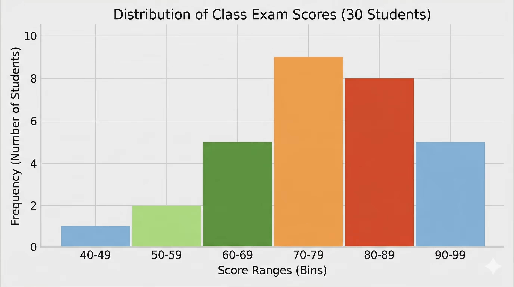

# Graphs for Univariate Analysis

When we isolate a single variable and analyze it on its own, we are performing **Univariate Analysis**. The goal here is simple: understand the distribution, range, central values, and patterns of one specific feature in our dataset before looking at how it interacts with other variables.

Just like bivariate analysis, the visual tools we choose depend entirely on whether the feature is **Categorical** or **Numerical**.

---

## 1. Categorical Data (Frequency Distribution)

For categorical variables, we want to know how often each distinct label or group appears in our dataset. We measure this using a frequency distribution.

### The Foundation: Frequency Table
Before plotting, we compile the unique categories and count how many times each one shows up. We can also calculate its relative frequency (the percentage of the total dataset).

**Scenario:** Let's look at a column tracking the **Primary Cloud Provider** used by 500 different tech startups.

| Cloud Provider | Absolute Frequency (Count) | Relative Frequency (Percentage) |
| :--- | :--- | :--- |
| **AWS** | 250 | 50% |
| **Google Cloud** | 150 | 30% |
| **Azure** | 100 | 20% |
| **Total** | **500** | **100%** |

### Visual Tools: Bar Charts and Pie Charts
* **Bar Chart:** The most common tool for categorical variables. Each category gets its own distinct bar, where the height represents either the raw count or the percentage. It makes comparing the popularity of categories very clear.
* **Pie Chart:** Useful only when you have a small number of categories that add up to a whole 100%. It visually slices up the data into proportions, though it becomes hard to read if you have more than 4 or 5 categories.

---

## 2. Numerical Data (Frequency Distribution)

For continuous numbers, we cannot just count every single unique value because almost every number could be slightly different (e.g., ages like 25.1, 25.4, 25.9). Instead, we group these continuous numbers into intervals called **bins** to see how the frequency is distributed across a spectrum.

### Visual Tool: Histograms
A **Histogram** looks similar to a bar chart, but there are no gaps between the bars. The continuous numerical range is sliced into equal-width buckets (bins), and the height of each bar shows how many data points fall inside that specific bucket.

**Scenario:** Plotting the distribution of exam scores for a class of 30 students, grouped into bins of 10 marks each.

Looking at this histogram, most students scored between 70 and 89, while very few scored below 50 or in the 90s. The bars touch each other because the x-axis is continuous. A score of 69 flows directly into the 70-79 bin, unlike a bar chart where each category is a separate, unrelated thing.

### Visual Tool: Kernel Density Estimate (KDE) / Density Plot
While a histogram uses rigid blocks, a **KDE Plot** smooths out the distribution using a continuous curve. It approximates the probability density function of the continuous variable, allowing us to see the shape of the data profile smoothly, without the boxy edges of a histogram.

### What a Data Scientist Looks For:
* **Symmetry (Normal Distribution):** Is the data bell-shaped, where most values sit right in the middle?
* **Skewness:** Is there a long tail dragging out to the far right (Positive/Right Skewed, like income data) or to the far left (Negative/Left Skewed, like age of retirement)?
* **Modality:** Does the data have one main peak (Unimodal) or multiple distinct peaks (Bimodal), showing that different sub-groups might be hidden within a single feature?