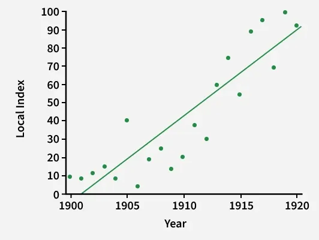

# Graphs for Bivariate Analysis

When we move from analyzing a single variable (univariate analysis) to studying the relationship between two variables at the same time, we are performing **Bivariate Analysis**. In statistics and machine learning, understanding how two features interact matters a lot for feature engineering, spotting correlations, and picking the right model type.

The visual tools we use for bivariate analysis depend entirely on whether the two variables we are comparing are **Categorical** or **Numerical**.

---

## 1. Categorical vs. Categorical Analysis

When comparing two categorical variables, our goal is to see how the groups overlap and whether membership in one category influences another.

### The Foundation: Contingency Table (Cross-Tabulation)
Before jumping into charts, we organize the raw frequencies into a **Contingency Table**. It cross-references the counts of each category combination. A related idea shows up later in classification, the confusion matrix, which is a specific kind of contingency table comparing predicted labels against actual labels.

**Scenario:** Let's look at a quick study analyzing whether a customer's **Subscription Plan** (Basic vs. Premium) relates to their **Churn Status** (Stayed vs. Left).

| Plan / Status | Stayed | Left | Total |
| :--- | :--- | :--- | :--- |
| **Basic** | 120 | 80 | 200 |
| **Premium** | 170 | 30 | 200 |
| **Total** | 290 | 110 | 400 |

### Visual Tool: Grouped or Stacked Bar Charts
To turn this table into a visual story, we map these counts onto a bar chart.
* **Grouped Bar Chart:** Places the bars for "Stayed" and "Left" side by side for each plan type, so you can directly compare raw volume.
* **Stacked Bar Chart:** Places the categories on top of each other, summing up to 100% of that group. This makes it instantly obvious that 40% ($80/200$) of Basic users left, compared to only 15% ($30/200$) of Premium users.

---

## 2. Numerical vs. Numerical Analysis

When both variables are continuous numbers, we want to see the direction, strength, and pattern of their relationship.

### Visual Tool: Scatter Plot
One of the most useful tools for comparing two numerical fields is the **Scatter Plot**. Each data point represents a single observation, where its position on the horizontal axis ($x$) represents one metric and its vertical position ($y$) represents the other.

**Scenario:** Imagine we are plotting **Years of Experience** ($x$) against **Annual Salary** ($y$).

As experience increases, salary tends to increase too. The dots roughly follow an upward line, which is a positive correlation.

### What a Data Scientist Looks For:
* **Direction:** Are the dots moving upwards together (Positive Correlation) or downwards (Negative Correlation)?
* **Strength:** How tightly packed are the dots around an imaginary straight line? Tight clusters mean a strong linear relationship.
* **Shape:** Is the relationship a straight line (Linear) or does it curve over time (Non-Linear, like an exponential growth curve)?

---

## 3. Categorical vs. Numerical Analysis

When we have one label or category and one continuous number, our goal is to compare the numerical distributions across the different distinct groups.

### Visual Tool: Bar Plots (and Box Plots)
To visualize this relationship, we split the continuous numerical data across the distinct categories.

**Scenario:** Comparing the **Average Delivery Time** (Numerical) across three different **Delivery Zones** (Categorical: Zone A, Zone B, Zone C).

* **Bar Plot (With Error Bars):** The height of the bar displays the mean or median value for that specific group (e.g., Zone A takes an average of 15 minutes, while Zone C takes 45 minutes).
* **Box Plot (Alternative/Advanced):** While a basic bar chart only gives us the single average value, a box plot displays the complete shape, spread, median, and outliers of the numerical data within each category group, giving a deeper understanding of variations within each group.